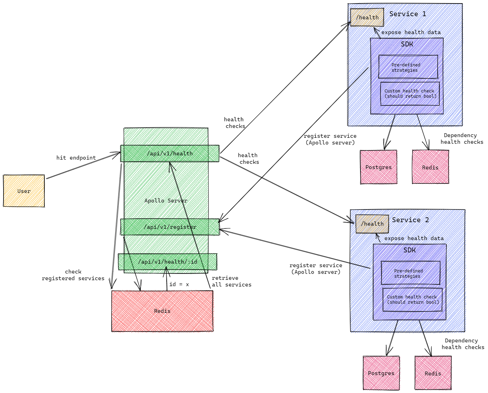
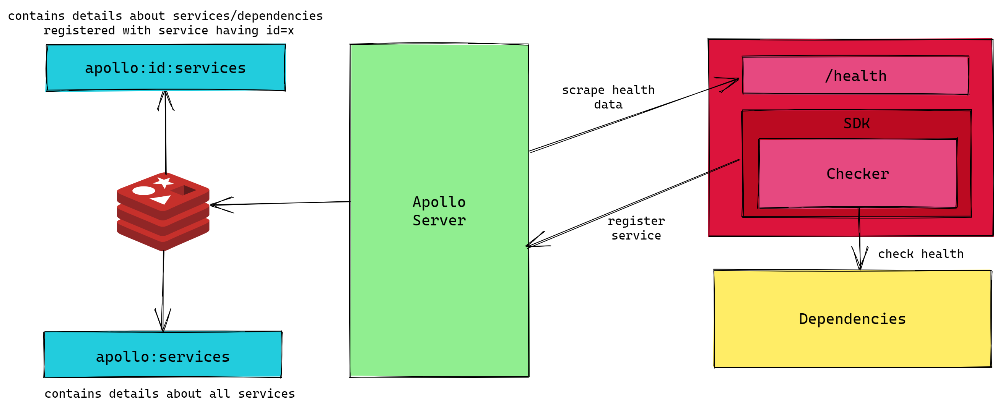

## Apollo Server

Apollo Server is written in **Go**.

To setup a local environment, please ensure that Go is installed on your machine.

Start by cloning the [repository](https://github.com/deepsourcelabs/apollo):

```
git clone https://github.com/deepsourcelabs/apollo
cd apollo
```

Set up a configuration file as shown in the [configuration documentation](/docs/config) (change values as required):

```yaml
redis:
  addr: "localhost:6379"
  password: ""
  db: 0

server:
  addr: "localhost:8080"

logging:
  file: "./test.log"

timeout:
  type: "minute"
  value: 5
```

Run the server:

```
go run cmd/apollo/main.go config --path config.yaml
```

**Makefile** coming soon.

### Architecture

Here is the complete architecture of Apollo:



Service data is stored using Redis, here is the data model:



## Apollo SDKs

Apollo SDKs are generally written in multiple languages, as per the requirement of the main application. To learn more about SDK development instructions, please visit the README of the specific SDK.
